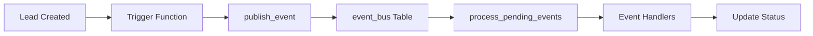

# Event Bus Documentation

## Overview

Event Bus - это система событий для обработки асинхронных событий в приложении. Используется для отслеживания изменений в системе и триггерирования автоматических действий.

## Architecture



## Database Schema

### Table: `event_bus`

```sql
CREATE TABLE public.event_bus (
  id UUID PRIMARY KEY DEFAULT gen_random_uuid(),
  event_type TEXT NOT NULL,
  aggregate_type TEXT NOT NULL,
  aggregate_id TEXT NOT NULL,
  payload JSONB DEFAULT '{}'::jsonb,
  metadata JSONB DEFAULT '{}'::jsonb,
  organization_id UUID,
  status TEXT DEFAULT 'pending' CHECK (status IN ('pending', 'processing', 'processed', 'failed')),
  created_at TIMESTAMP WITH TIME ZONE DEFAULT now(),
  processed_at TIMESTAMP WITH TIME ZONE,
  retry_count INTEGER DEFAULT 0,
  error_message TEXT
);
```

## Functions

### 1. `publish_event`

Публикует новое событие в Event Bus.

```sql
FUNCTION public.publish_event(
  p_event_type TEXT,
  p_aggregate_type TEXT,
  p_aggregate_id TEXT,
  p_payload JSONB DEFAULT '{}'::jsonb,
  p_metadata JSONB DEFAULT '{}'::jsonb,
  p_organization_id UUID DEFAULT NULL
) RETURNS UUID
```

**Пример использования:**

```typescript
const { data, error } = await supabase.rpc('publish_event', {
  p_event_type: 'lead.created',
  p_aggregate_type: 'lead',
  p_aggregate_id: leadId,
  p_payload: {
    lead_id: leadId,
    first_name: 'John',
    last_name: 'Doe',
    phone: '+79991234567'
  },
  p_metadata: { source: 'web_form' },
  p_organization_id: organizationId
});
```

### 2. `process_pending_events`

Обрабатывает pending события из очереди.

```sql
FUNCTION public.process_pending_events(
  p_limit INTEGER DEFAULT 100
) RETURNS INTEGER
```

**Пример использования:**

```typescript
const { data, error } = await supabase.rpc('process_pending_events', {
  p_limit: 50
});
```

## Event Types

### Lead Events

#### `lead.created`

Публикуется при создании нового лида.

**Payload:**
```json
{
  "lead_id": "uuid",
  "first_name": "string",
  "last_name": "string",
  "phone": "string",
  "status_id": "uuid",
  "lead_source_id": "uuid",
  "organization_id": "uuid"
}
```

**Metadata:**
```json
{
  "trigger": "insert"
}
```

#### `lead.status_updated`

Публикуется при изменении статуса лида.

**Payload:**
```json
{
  "lead_id": "uuid",
  "first_name": "string",
  "last_name": "string",
  "old_status_id": "uuid",
  "new_status_id": "uuid",
  "organization_id": "uuid"
}
```

**Metadata:**
```json
{
  "trigger": "update"
}
```

## Triggers

### `trigger_lead_created`

Автоматически публикует событие `lead.created` при создании лида.

```sql
CREATE TRIGGER on_lead_created
  AFTER INSERT ON public.leads
  FOR EACH ROW
  EXECUTE FUNCTION public.trigger_lead_created();
```

### `trigger_lead_status_updated`

Автоматически публикует событие `lead.status_updated` при изменении статуса лида.

```sql
CREATE TRIGGER on_lead_status_updated
  AFTER UPDATE ON public.leads
  FOR EACH ROW
  EXECUTE FUNCTION public.trigger_lead_status_updated();
```

## React Hooks

### `useEvents()`

Получает список событий из Event Bus.

```typescript
import { useEvents } from '@/hooks/useEventBus';

const { data: events, isLoading } = useEvents({
  status: 'pending',
  event_type: 'lead.created'
});
```

**Параметры:**
- `status`: Фильтр по статусу (pending | processing | processed | failed)
- `event_type`: Фильтр по типу события
- `aggregate_type`: Фильтр по типу агрегата

### `usePublishEvent()`

Публикует событие в Event Bus.

```typescript
import { usePublishEvent } from '@/hooks/useEventBus';

const publishEvent = usePublishEvent();

publishEvent.mutate({
  event_type: 'custom.event',
  aggregate_type: 'custom',
  aggregate_id: 'some-id',
  payload: { key: 'value' },
  metadata: { source: 'manual' }
});
```

### `useProcessPendingEvents()`

Запускает обработку pending событий.

```typescript
import { useProcessPendingEvents } from '@/hooks/useEventBus';

const processPendingEvents = useProcessPendingEvents();

processPendingEvents.mutate(100); // Process up to 100 events
```

### `useEventStats()`

Получает статистику событий за последние 24 часа.

```typescript
import { useEventStats } from '@/hooks/useEventBus';

const { data: stats } = useEventStats();
// stats = { pending: 5, processing: 2, processed: 100, failed: 1, total: 108 }
```

## UI Components

### Event Bus Monitor

Страница для мониторинга событий Event Bus.

**URL:** `/crm/events`

**Доступ:** Только для админов

**Функции:**
- Просмотр статистики событий
- Список последних 100 событий
- Ручная обработка pending событий
- Детальная информация о каждом событии

## RLS Policies

### SELECT Policy

```sql
CREATE POLICY "Users can view events from their organization"
  ON public.event_bus
  FOR SELECT
  USING (organization_id IN (
    SELECT profiles.organization_id
    FROM profiles
    WHERE profiles.id = auth.uid()
  ));
```

### INSERT Policy

```sql
CREATE POLICY "System can insert events"
  ON public.event_bus
  FOR INSERT
  WITH CHECK (true);
```

### UPDATE Policy

```sql
CREATE POLICY "System can update events"
  ON public.event_bus
  FOR UPDATE
  USING (true);
```

## Best Practices

1. **Always include organization_id** - для правильной изоляции данных
2. **Use meaningful event types** - используйте понятные имена событий (например, `lead.created`, `payment.completed`)
3. **Keep payload minimal** - включайте только необходимые данные
4. **Use metadata for context** - используйте metadata для дополнительной информации
5. **Handle errors gracefully** - всегда проверяйте ошибки при публикации событий
6. **Monitor failed events** - регулярно проверяйте failed события в Event Bus Monitor

## Troubleshooting

### События не создаются

1. Проверьте, что триггеры установлены:
```sql
SELECT * FROM pg_trigger WHERE tgname LIKE '%lead%';
```

2. Проверьте логи базы данных:
```sql
SELECT * FROM postgres_logs ORDER BY timestamp DESC LIMIT 100;
```

### События застревают в pending

1. Вызовите `process_pending_events` вручную
2. Проверьте error_message для failed событий
3. Проверьте RLS политики

### Не видны события других организаций

Это нормальное поведение! Event Bus изолирует данные по organization_id.

## Examples

### Создание кастомного события

```typescript
// В компоненте
const publishEvent = usePublishEvent();

const handlePaymentComplete = async (paymentId: string, amount: number) => {
  publishEvent.mutate({
    event_type: 'payment.completed',
    aggregate_type: 'payment',
    aggregate_id: paymentId,
    payload: {
      payment_id: paymentId,
      amount: amount,
      currency: 'RUB'
    },
    metadata: {
      source: 'payment_form',
      timestamp: new Date().toISOString()
    }
  });
};
```

### Просмотр событий в компоненте

```typescript
const { data: events } = useEvents({ event_type: 'payment.completed' });

return (
  <div>
    {events?.map(event => (
      <div key={event.id}>
        <h3>{event.event_type}</h3>
        <pre>{JSON.stringify(event.payload, null, 2)}</pre>
        <Badge>{event.status}</Badge>
      </div>
    ))}
  </div>
);
```

## Security

- ✅ All functions use `SECURITY DEFINER SET search_path = public`
- ✅ RLS policies enforce organization isolation
- ✅ Only authenticated users can view events
- ✅ System has full access for event processing

## Future Enhancements

- [ ] Event replay mechanism
- [ ] Dead letter queue for failed events
- [ ] Event versioning
- [ ] Webhook notifications
- [ ] Event search and filtering UI
- [ ] Event analytics dashboard
- [ ] Scheduled event processing (cron)
