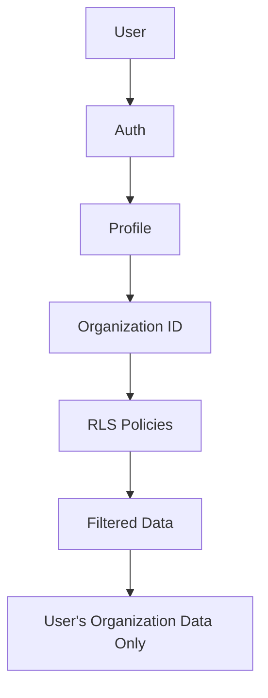

# Multitenancy Documentation

## Overview

Система поддерживает полную изоляцию данных между организациями (multitenancy) с использованием Row-Level Security (RLS) в Supabase.

## Architecture



## Core Components

### 1. Organizations Table

```sql
CREATE TABLE public.organizations (
  id UUID PRIMARY KEY DEFAULT gen_random_uuid(),
  name TEXT NOT NULL,
  is_active BOOLEAN DEFAULT true,
  created_at TIMESTAMP WITH TIME ZONE DEFAULT now(),
  updated_at TIMESTAMP WITH TIME ZONE DEFAULT now()
);
```

### 2. Profiles Table

Хранит organization_id для каждого пользователя.

```sql
CREATE TABLE public.profiles (
  id UUID PRIMARY KEY REFERENCES auth.users(id),
  organization_id UUID REFERENCES public.organizations(id),
  first_name TEXT,
  last_name TEXT,
  ...
);
```

### 3. Helper Function

`get_user_organization_id()` - возвращает organization_id текущего пользователя.

```sql
CREATE FUNCTION public.get_user_organization_id()
RETURNS UUID
LANGUAGE sql
STABLE
SECURITY DEFINER
SET search_path = public
AS $$
  SELECT organization_id
  FROM profiles
  WHERE id = auth.uid()
$$;
```

## RLS Patterns

### Pattern 1: View Only Your Organization

```sql
CREATE POLICY "Users can view data in their organization"
  ON public.table_name
  FOR SELECT
  USING (organization_id = get_user_organization_id());
```

### Pattern 2: Manage Data in Your Organization

```sql
CREATE POLICY "Users can manage data in their organization"
  ON public.table_name
  FOR ALL
  USING (
    organization_id = get_user_organization_id() 
    AND auth.uid() IS NOT NULL
  )
  WITH CHECK (
    organization_id = get_user_organization_id() 
    AND auth.uid() IS NOT NULL
  );
```

### Pattern 3: Role-Based Access

```sql
CREATE POLICY "Admins and managers can manage data"
  ON public.table_name
  FOR ALL
  USING (
    organization_id = get_user_organization_id()
    AND (
      has_role(auth.uid(), 'admin'::app_role)
      OR has_role(auth.uid(), 'manager'::app_role)
    )
  );
```

## Tables with Multitenancy

### ✅ Fully Implemented

- **clients** - Клиенты с organization_id
- **leads** - Лиды с organization_id  
- **students** - Ученики с organization_id
- **teachers** - Преподаватели с organization_id
- **learning_groups** - Группы с organization_id
- **lesson_sessions** - Занятия с organization_id
- **chat_messages** - Сообщения с organization_id
- **call_logs** - Звонки с organization_id
- **event_bus** - События с organization_id
- **family_groups** - Семьи с organization_id

### Table: `leads`

**Organization Field:** `organization_id UUID NOT NULL DEFAULT '00000000-0000-0000-0000-000000000001'`

**RLS Policies:**

1. **SELECT Policy:**
```sql
CREATE POLICY "Users can view leads in their organization"
  ON public.leads
  FOR SELECT
  USING (organization_id = get_user_organization_id());
```

2. **ALL Policy:**
```sql
CREATE POLICY "Users can manage leads in their organization"
  ON public.leads
  FOR ALL
  USING (
    organization_id = get_user_organization_id()
    AND auth.uid() IS NOT NULL
    AND (
      has_role(auth.uid(), 'admin'::app_role)
      OR has_role(auth.uid(), 'sales_manager'::app_role)
      OR has_role(auth.uid(), 'marketing_manager'::app_role)
      OR has_role(auth.uid(), 'manager'::app_role)
    )
  )
  WITH CHECK (
    organization_id = get_user_organization_id()
    AND auth.uid() IS NOT NULL
    AND (
      has_role(auth.uid(), 'admin'::app_role)
      OR has_role(auth.uid(), 'sales_manager'::app_role)
      OR has_role(auth.uid(), 'marketing_manager'::app_role)
      OR has_role(auth.uid(), 'manager'::app_role)
    )
  );
```

## Frontend Integration

### Helper Function

```typescript
// src/lib/organizationHelpers.ts
export const getCurrentOrganizationId = async (): Promise<string> => {
  const { data: { user } } = await supabase.auth.getUser();
  
  if (!user) {
    throw new Error('User not authenticated');
  }

  const { data: profile, error } = await supabase
    .from('profiles')
    .select('organization_id')
    .eq('id', user.id)
    .single();

  if (error || !profile?.organization_id) {
    throw new Error('Could not get organization ID');
  }

  return profile.organization_id;
};
```

### Usage in Components

#### Creating Leads with Organization ID

```typescript
// src/components/leads/CreateLeadDialog.tsx
const handleSubmit = async (e: React.FormEvent) => {
  const { data: userData } = await supabase.auth.getUser();
  
  // Get user's organization_id
  const { data: profile } = await supabase
    .from("profiles")
    .select("organization_id")
    .eq("id", userData?.user?.id)
    .single();
  
  const { error } = await supabase.from("leads").insert({
    ...formData,
    organization_id: profile?.organization_id, // ✅ Правильно
  });
};
```

#### Webhook Integration

```typescript
// supabase/functions/onlinepbx-webhook/index.ts

// Get default organization
const { data: defaultOrg } = await supabase
  .from('organizations')
  .select('id')
  .eq('is_active', true)
  .limit(1)
  .single();

// Create client with organization_id
const { data: newClient } = await supabase
  .from('clients')
  .insert({
    name: clientName,
    phone: selectedPhone,
    organization_id: defaultOrg.id, // ✅ Правильно
  });

// Create lead with organization_id
const { data: newLead } = await supabase
  .from('leads')
  .insert({
    first_name: 'Клиент',
    last_name: phone,
    organization_id: defaultOrg.id, // ✅ Правильно
  });
```

## Testing Multitenancy

### Automated Tests

Используйте `/crm/test-multitenancy` для автоматического тестирования:

```typescript
// src/pages/MultitenancyTest.tsx

// Test 1: User has organization_id
const orgId = await getCurrentOrganizationId();

// Test 2: Can only see own organization's leads
const { data: leads } = await supabase
  .from("leads")
  .select("*");

// All leads should have same organization_id
const allSameOrg = leads?.every(
  l => l.organization_id === currentUser.profile.organization_id
);

// Test 3: Cannot access other organization's data
const { data: otherOrgLeads } = await supabase
  .from("leads")
  .eq("organization_id", otherOrgId);

// Should return empty array
expect(otherOrgLeads).toHaveLength(0);
```

### Manual Testing

1. Создайте 2 организации
2. Создайте пользователей в разных организациях
3. Войдите как User 1 и создайте лида
4. Войдите как User 2 - не должны видеть лида User 1
5. Проверьте Event Bus - события изолированы по organization_id

## Common Issues

### ❌ Issue: "Row violates row-level security policy"

**Причина:** Не установлен organization_id при создании записи.

**Решение:**

```typescript
// ❌ Неправильно
await supabase.from("leads").insert({ first_name: "John" });

// ✅ Правильно
const orgId = await getCurrentOrganizationId();
await supabase.from("leads").insert({
  first_name: "John",
  organization_id: orgId
});
```

### ❌ Issue: Видны данные из других организаций

**Причина:** RLS политика не настроена или неправильная.

**Решение:**

1. Проверьте, что RLS включен:
```sql
ALTER TABLE public.table_name ENABLE ROW LEVEL SECURITY;
```

2. Проверьте политику:
```sql
SELECT * FROM pg_policies WHERE tablename = 'table_name';
```

3. Используйте `get_user_organization_id()` в политиках.

### ❌ Issue: Cannot insert into table

**Причина:** WITH CHECK в RLS политике блокирует вставку.

**Решение:**

Проверьте, что organization_id соответствует текущему пользователю:

```sql
WITH CHECK (organization_id = get_user_organization_id())
```

## Security Checklist

- [x] Все таблицы с PII имеют RLS
- [x] Все таблицы с данными организаций имеют organization_id
- [x] organization_id NOT NULL с default значением
- [x] RLS политики используют get_user_organization_id()
- [x] Все функции с SECURITY DEFINER имеют SET search_path
- [x] Webhook создает записи с правильным organization_id
- [x] Frontend компоненты получают organization_id перед созданием записей

## Migration Guide

### Adding Multitenancy to Existing Table

```sql
-- Step 1: Add organization_id column
ALTER TABLE public.table_name
  ADD COLUMN organization_id UUID 
  REFERENCES public.organizations(id)
  DEFAULT '00000000-0000-0000-0000-000000000001'
  NOT NULL;

-- Step 2: Enable RLS
ALTER TABLE public.table_name ENABLE ROW LEVEL SECURITY;

-- Step 3: Add SELECT policy
CREATE POLICY "Users can view data in their organization"
  ON public.table_name
  FOR SELECT
  USING (organization_id = get_user_organization_id());

-- Step 4: Add INSERT/UPDATE/DELETE policies
CREATE POLICY "Users can manage data in their organization"
  ON public.table_name
  FOR ALL
  USING (
    organization_id = get_user_organization_id()
    AND auth.uid() IS NOT NULL
  )
  WITH CHECK (
    organization_id = get_user_organization_id()
    AND auth.uid() IS NOT NULL
  );

-- Step 5: Create index for performance
CREATE INDEX idx_table_name_organization_id 
  ON public.table_name(organization_id);
```

## Performance Considerations

1. **Index organization_id** - всегда создавайте индекс на organization_id
2. **Use SECURITY DEFINER functions** - избегайте сложных подзапросов в RLS
3. **Minimize RLS complexity** - простые политики работают быстрее
4. **Cache organization_id** - не запрашивайте каждый раз

## Future Enhancements

- [ ] Organization switching for super admins
- [ ] Multi-organization users
- [ ] Organization hierarchies (parent/child)
- [ ] Cross-organization data sharing
- [ ] Organization-level feature flags
- [ ] Usage limits per organization
