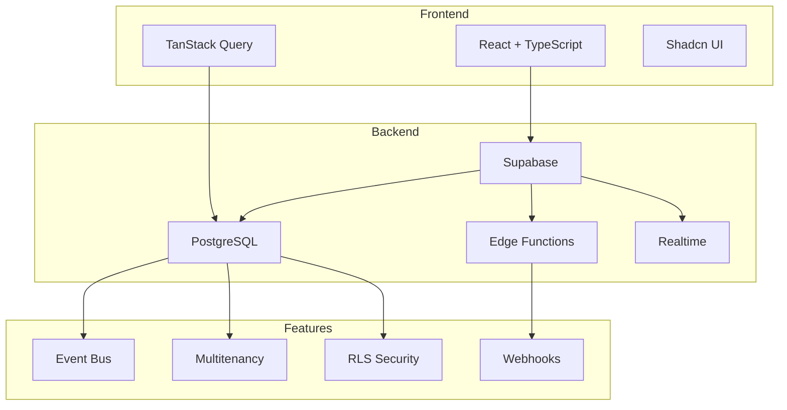

# HoliHope CRM Documentation

## 📚 Table of Contents

- [Overview](#overview)
- [Architecture](#architecture)
- [Key Features](#key-features)
- [Documentation](#documentation)
- [Getting Started](#getting-started)
- [Tech Stack](#tech-stack)

## Overview

HoliHope CRM - это полнофункциональная система управления учебным центром с поддержкой multitenancy, включающая управление лидами, студентами, расписанием, финансами и коммуникациями.

## Architecture



## Key Features

### 🎯 Core Functionality

- **Lead Management** - Управление лидами с воронкой продаж
- **Student Management** - База студентов с историей занятий
- **Teacher Management** - Управление преподавателями и нагрузкой
- **Schedule** - Расписание групповых и индивидуальных занятий
- **Finances** - Управление платежами, балансами, зарплатами
- **Communications** - WhatsApp, Telegram, внутренний чат
- **Analytics** - Отчёты и аналитика по всем направлениям

### 🔐 Security

- **Row-Level Security (RLS)** - Изоляция данных на уровне базы
- **Multitenancy** - Полная изоляция организаций
- **Role-Based Access** - Гранулярный контроль доступа
- **Secure Functions** - Все функции защищены от SQL-инъекций

### ⚡ Performance

- **Lazy Loading** - Модальные окна загружаются по требованию
- **React Query** - Умное кеширование данных
- **Virtualized Lists** - Быстрый рендеринг больших списков
- **Edge Functions** - Serverless обработка webhook'ов

### 🎨 UX/UI

- **Mobile Responsive** - Адаптивный дизайн для всех устройств
- **Dark Mode** - Поддержка тёмной темы
- **Real-time Updates** - Live обновления через Supabase Realtime
- **Visual Edits** - Редактирование интерфейса без кода

## Documentation

### Core Systems

- [Event Bus](./EVENT_BUS.md) - Система событий и асинхронная обработка
- [Multitenancy](./MULTITENANCY.md) - Изоляция данных между организациями
- [Security](./SECURITY.md) - Security warnings и best practices
- [API Reference](./API.md) - Документация API и хуков

### Features

- [Lead Management](./features/LEADS.md) - Работа с лидами
- [Schedule System](./features/SCHEDULE.md) - Система расписания
- [Finances](./features/FINANCES.md) - Финансовый модуль
- [Communications](./features/COMMUNICATIONS.md) - Мессенджеры и чат

### Development

- [Setup Guide](./SETUP.md) - Настройка проекта
- [Contributing](./CONTRIBUTING.md) - Как контрибьютить
- [Testing](./TESTING.md) - Тестирование функциональности

## Getting Started

### Prerequisites

- Node.js 18+ 
- npm or yarn
- Supabase account

### Installation

```bash
# Clone repository
git clone <repo-url>
cd holihope-crm

# Install dependencies
npm install

# Setup environment
cp .env.example .env
# Edit .env with your Supabase credentials

# Run development server
npm run dev
```

### First Steps

1. **Setup Organization**
   ```sql
   INSERT INTO organizations (name) VALUES ('My School');
   ```

2. **Create Admin User**
   - Sign up through /auth/signup
   - Add admin role in `user_roles` table

3. **Configure Settings**
   - Navigate to Settings → Organization
   - Set up branches, subjects, pricing

4. **Import Data** (optional)
   - Go to Students section
   - Use Import feature for bulk upload

## Tech Stack

### Frontend

- **React 18** - UI framework
- **TypeScript** - Type safety
- **Vite** - Build tool
- **TanStack Query** - Data fetching & caching
- **React Router** - Routing
- **Shadcn UI** - Component library
- **Tailwind CSS** - Styling
- **Lucide Icons** - Icons

### Backend

- **Supabase** - Backend-as-a-Service
- **PostgreSQL** - Database
- **Edge Functions** - Serverless compute
- **Realtime** - Live updates
- **Storage** - File storage

### Tools & Libraries

- **date-fns** - Date manipulation
- **zod** - Schema validation
- **sonner** - Toast notifications
- **ag-grid** - Data tables
- **recharts** - Charts
- **papaparse** - CSV parsing

## Project Structure

```
src/
├── components/       # React components
│   ├── ui/          # Base UI components (shadcn)
│   ├── crm/         # CRM-specific components
│   ├── leads/       # Lead management
│   ├── students/    # Student management
│   └── ...
├── hooks/           # Custom React hooks
├── lib/             # Utility functions
├── pages/           # Page components
├── integrations/    # External integrations
│   └── supabase/    # Supabase client
└── assets/          # Static assets

supabase/
├── functions/       # Edge Functions
└── migrations/      # Database migrations

docs/                # Documentation
└── ...
```

## Key Concepts

### Event Bus

Система событий для автоматизации процессов:

```typescript
// Публикация события
const publishEvent = usePublishEvent();
publishEvent.mutate({
  event_type: 'lead.created',
  aggregate_type: 'lead',
  aggregate_id: leadId,
  payload: { ... }
});

// Подписка на события
const { data: events } = useEvents({ 
  event_type: 'lead.created' 
});
```

[Подробнее →](./EVENT_BUS.md)

### Multitenancy

Полная изоляция данных между организациями:

```typescript
// Автоматическая фильтрация по organization_id
const { data: leads } = useQuery({
  queryKey: ['leads'],
  queryFn: async () => {
    const { data } = await supabase
      .from('leads')
      .select('*'); // RLS автоматически фильтрует
    return data;
  }
});
```

[Подробнее →](./MULTITENANCY.md)

### Role-Based Access

Гранулярный контроль доступа:

```typescript
// Проверка роли на фронтенде
<ProtectedRoute allowedRoles={['admin', 'manager']}>
  <AdminPanel />
</ProtectedRoute>

// Проверка роли в RLS
CREATE POLICY "Admins can manage"
  ON table_name
  USING (has_role(auth.uid(), 'admin'));
```

## Common Tasks

### Adding a New Table with Multitenancy

```sql
-- 1. Create table
CREATE TABLE my_table (
  id UUID PRIMARY KEY DEFAULT gen_random_uuid(),
  organization_id UUID NOT NULL REFERENCES organizations(id),
  name TEXT NOT NULL,
  created_at TIMESTAMPTZ DEFAULT now()
);

-- 2. Enable RLS
ALTER TABLE my_table ENABLE ROW LEVEL SECURITY;

-- 3. Add policies
CREATE POLICY "Users view own org data"
  ON my_table FOR SELECT
  USING (organization_id = get_user_organization_id());

CREATE POLICY "Users manage own org data"
  ON my_table FOR ALL
  USING (organization_id = get_user_organization_id())
  WITH CHECK (organization_id = get_user_organization_id());

-- 4. Create index
CREATE INDEX idx_my_table_org ON my_table(organization_id);
```

### Adding a New Event Type

```sql
-- 1. Create trigger function
CREATE FUNCTION trigger_my_event()
RETURNS TRIGGER
LANGUAGE plpgsql
SECURITY DEFINER
SET search_path = public
AS $$
BEGIN
  PERFORM publish_event(
    'my.event',
    'my_aggregate',
    NEW.id::text,
    jsonb_build_object('key', NEW.value),
    jsonb_build_object('trigger', 'insert'),
    NEW.organization_id
  );
  RETURN NEW;
END;
$$;

-- 2. Attach trigger
CREATE TRIGGER on_my_event
  AFTER INSERT ON my_table
  FOR EACH ROW
  EXECUTE FUNCTION trigger_my_event();
```

## Monitoring & Debugging

### Event Bus Monitor

Navigate to `/crm/events` to view:
- Event statistics
- Recent events
- Failed events
- Manual event processing

### Multitenancy Test

Navigate to `/crm/test-multitenancy` to verify:
- Organization isolation
- RLS policies
- Cross-organization access prevention

### Database Linter

```bash
# Run Supabase linter
npm run db:lint
```

Common issues:
- Function Search Path Mutable
- Extension in Public Schema
- Leaked Password Protection

[See SECURITY.md for fixes →](./SECURITY.md)

## Performance Tips

1. **Use Lazy Loading** for heavy components
2. **Implement Pagination** for large lists
3. **Cache with React Query** for frequently accessed data
4. **Use Indexes** on frequently queried columns
5. **Batch Operations** when possible
6. **Use Edge Functions** for heavy computations

## Support

- **Documentation**: `/docs`
- **Discord**: [Lovable Community](https://discord.com/invite/lovable)
- **Issues**: GitHub Issues
- **Email**: support@holihope.com

## License

Proprietary - © 2025 HoliHope

---

**Last Updated:** 2025-10-30  
**Version:** 1.0.0  
**Status:** ✅ Production Ready
