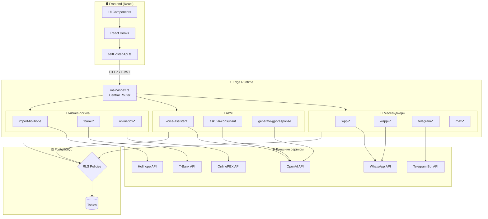
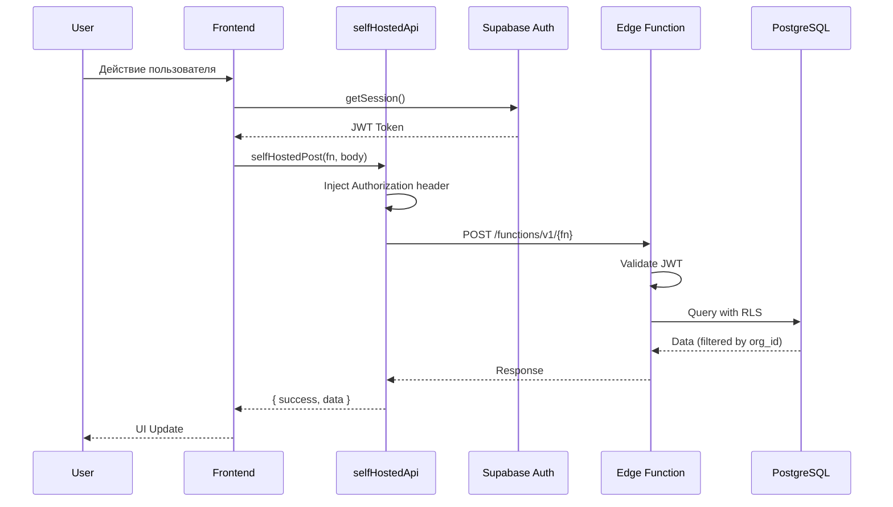
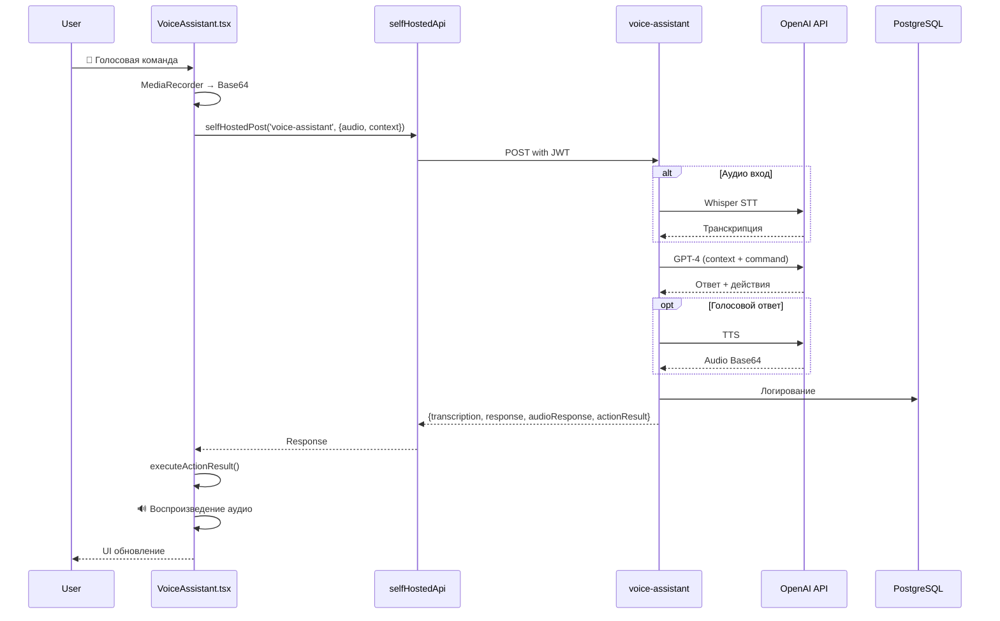
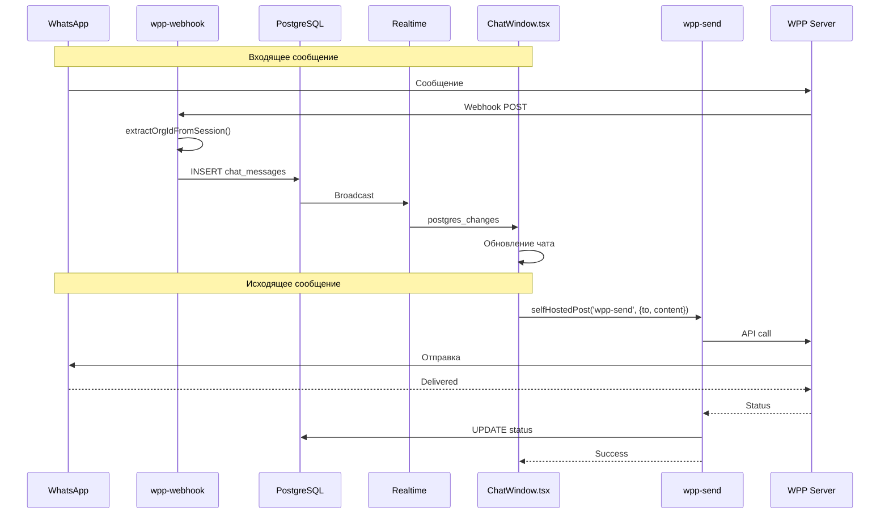
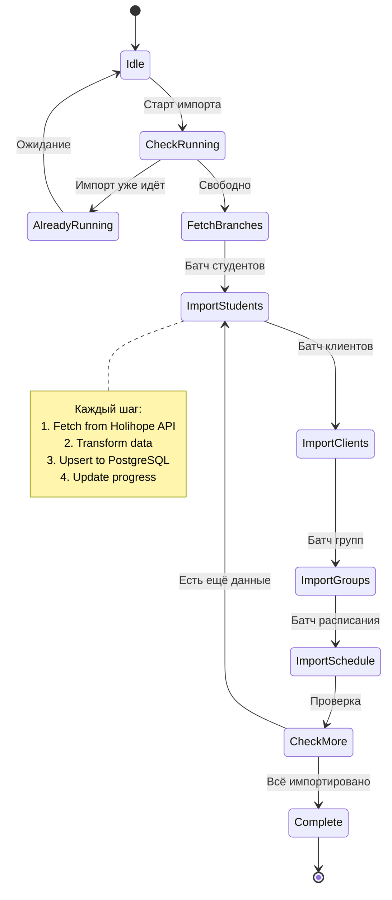
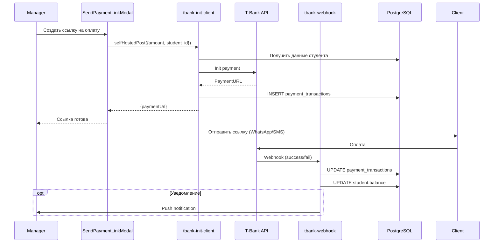
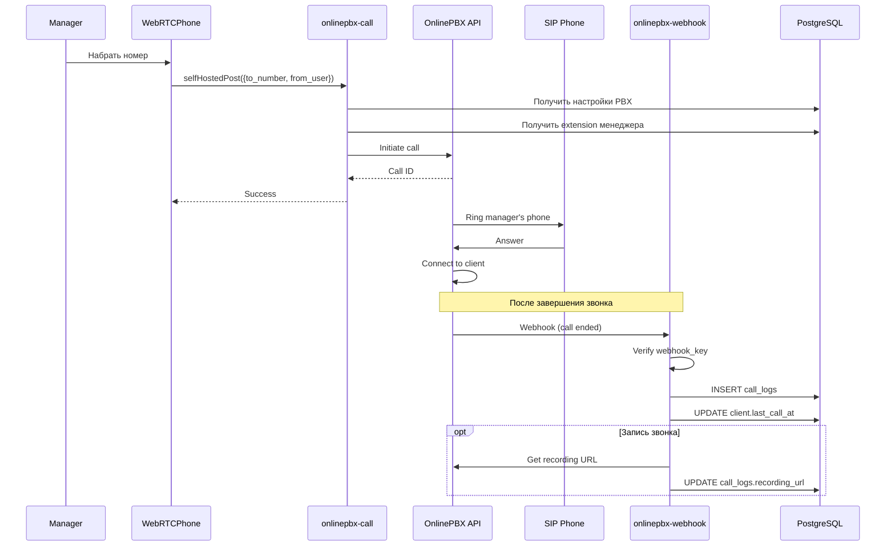
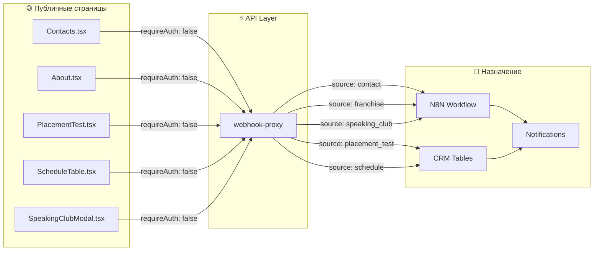
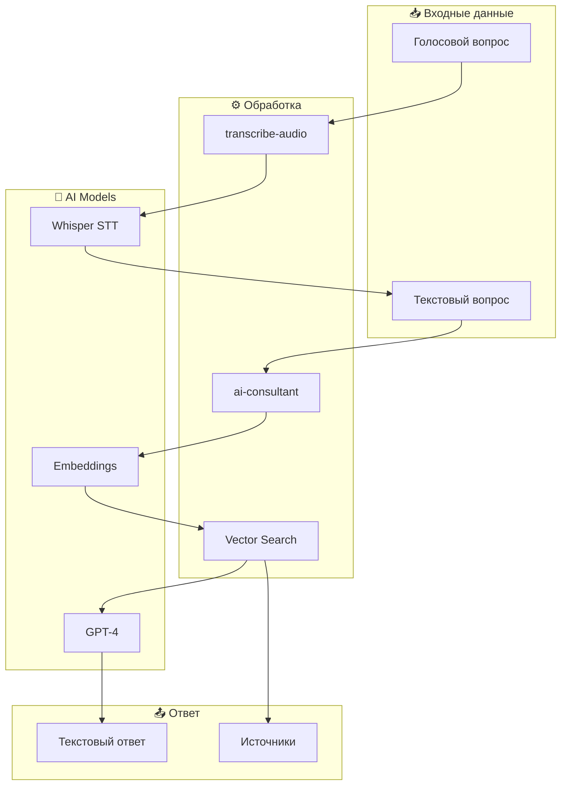
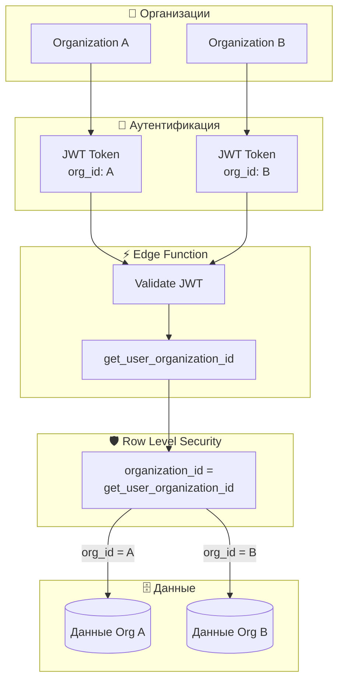

# Data Flow Diagrams

> **Дата:** 2026-01-26  
> **Версия:** 1.0

## Общая архитектура потоков данных



## Поток аутентификации



## Поток голосового ассистента



## Поток WhatsApp сообщений (WPP)



## Поток импорта Holihope



## Поток платежей T-Bank



## Поток OnlinePBX звонков



## Поток публичных форм



## Поток AI консультанта



## Мультитенантность и изоляция данных



## Cron Jobs и фоновые задачи

```mermaid
gantt
    title Расписание Cron Jobs
    dateFormat HH:mm
    axisFormat %H:%M
    
    section Мониторинг
    edge-health-monitor     :crit, 00:00, 5m
    sla-monitor            :00:00, 5m
    
    section Импорт
    import-salebot-chats-auto :06:00, 30m
    refresh-chat-threads-mv   :every 15min, 5m
    
    section Уведомления
    lesson-reminders         :08:00, 10m
    auto-payment-notifications :09:00, 15m
    
    section Обработка
    process-events          :active, every 1min, 1m
```

## Связанные документы

- [Self-Hosted API Architecture](./self-hosted-api.md)
- [Edge Functions Deployment](../migration/11-edge-functions-deployment.md)
- [RLS Policies](../migration/07-rls-policies.sql)
