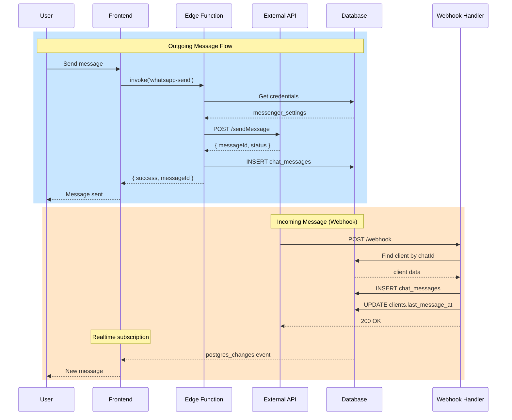
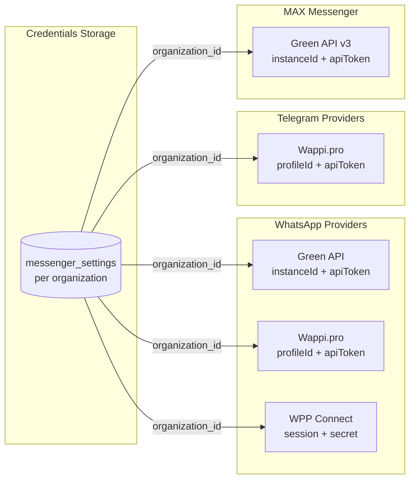
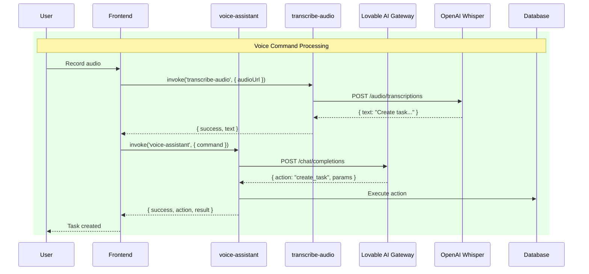
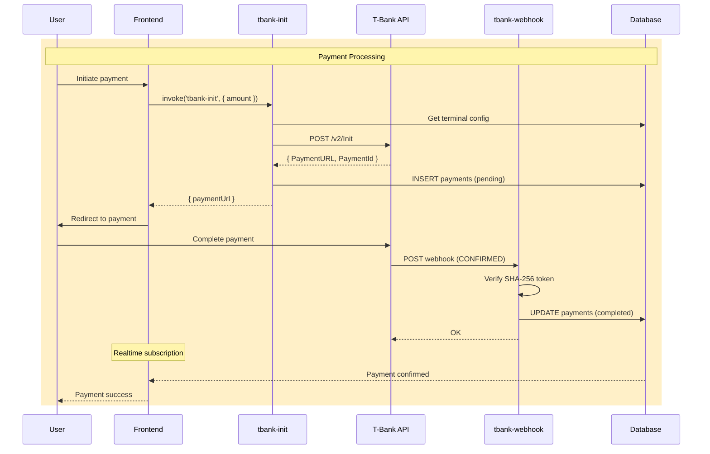

# Edge Functions Shared Types Documentation

This directory contains centralized TypeScript types and utilities for all Supabase Edge Functions.

## Table of Contents

- [Architecture Overview](#architecture-overview)
- [Data Flow Diagrams](#data-flow-diagrams)
- [Overview](#overview)
- [Quick Start](#quick-start)
- [Core Utilities](#core-utilities)
- [Type Categories](#type-categories)
- [Usage Examples](#usage-examples)

---

## Architecture Overview

### System Architecture

```mermaid
graph TB
    subgraph "Frontend - React App"
        UI[UI Components]
        Hooks[React Hooks]
    end

    subgraph "Supabase Edge Functions"
        direction TB
        
        subgraph "Messenger Send Functions"
            WA_SEND[whatsapp-send]
            WAPPI_SEND[wappi-whatsapp-send]
            WPP_SEND[wpp-send]
            TG_SEND[telegram-send]
            MAX_SEND[max-send]
        end
        
        subgraph "Webhook Handlers"
            WA_WH[whatsapp-webhook]
            WAPPI_WH[wappi-whatsapp-webhook]
            WPP_WH[wpp-webhook]
            TG_WH[telegram-webhook]
            MAX_WH[max-webhook]
            SB_WH[salebot-webhook]
            PBX_WH[onlinepbx-webhook]
            TBANK_WH[tbank-webhook]
        end
        
        subgraph "AI Functions"
            GPT[gpt-chat]
            VOICE[voice-assistant]
            TRANS[transcribe-audio]
        end
        
        subgraph "System Functions"
            HEALTH[health-check]
            PUSH[push-notification]
        end
        
        subgraph "Session Management"
            WPP_START[wpp-start]
            WPP_STATUS[wpp-status]
        end
    end

    subgraph "External APIs"
        direction TB
        GREEN[Green API<br/>WhatsApp]
        WAPPI[Wappi.pro<br/>WhatsApp/Telegram]
        WPP_SERVER[WPP Connect<br/>Server]
        OPENAI[OpenAI<br/>Whisper API]
        LOVABLE_AI[Lovable AI<br/>Gateway]
        TBANK[T-Bank<br/>Payments]
        PBX[OnlinePBX<br/>Telephony]
        SALEBOT[Salebot<br/>CRM]
    end

    subgraph "Database"
        DB[(Supabase<br/>PostgreSQL)]
    end

    %% Frontend to Edge Functions
    UI --> Hooks
    Hooks -->|invoke| WA_SEND
    Hooks -->|invoke| WAPPI_SEND
    Hooks -->|invoke| WPP_SEND
    Hooks -->|invoke| TG_SEND
    Hooks -->|invoke| MAX_SEND
    Hooks -->|invoke| GPT
    Hooks -->|invoke| VOICE
    Hooks -->|invoke| WPP_START

    %% Send Functions to External APIs
    WA_SEND -->|POST /sendMessage| GREEN
    WAPPI_SEND -->|POST /message/send| WAPPI
    WPP_SEND -->|POST /send-message| WPP_SERVER
    TG_SEND -->|POST /message/send| WAPPI
    MAX_SEND -->|POST /sendMessage| GREEN

    %% External APIs to Webhooks
    GREEN -->|POST webhook| WA_WH
    GREEN -->|POST webhook| MAX_WH
    WAPPI -->|POST webhook| WAPPI_WH
    WAPPI -->|POST webhook| TG_WH
    WPP_SERVER -->|POST webhook| WPP_WH
    SALEBOT -->|POST webhook| SB_WH
    PBX -->|POST webhook| PBX_WH
    TBANK -->|POST webhook| TBANK_WH

    %% AI Functions to External APIs
    GPT -->|POST /chat/completions| LOVABLE_AI
    VOICE -->|POST /chat/completions| LOVABLE_AI
    TRANS -->|POST /audio/transcriptions| OPENAI

    %% Session Management
    WPP_START -->|POST /start-session| WPP_SERVER
    WPP_STATUS -->|GET /status| WPP_SERVER

    %% All Functions to Database
    WA_SEND --> DB
    WAPPI_SEND --> DB
    WPP_SEND --> DB
    TG_SEND --> DB
    MAX_SEND --> DB
    WA_WH --> DB
    WAPPI_WH --> DB
    WPP_WH --> DB
    TG_WH --> DB
    MAX_WH --> DB
    SB_WH --> DB
    PBX_WH --> DB
    TBANK_WH --> DB
    VOICE --> DB
    HEALTH --> DB
    PUSH --> DB
```



---

## Data Flow Diagrams

### Message Send Flow



### Messenger Providers



### AI Processing Flow



### Payment Flow



---

## Overview

The `types.ts` file provides:
- **Unified interfaces** for all Edge Function API contracts
- **CORS handling** with standardized headers
- **Response helpers** for consistent API responses
- **Error utilities** for safe error extraction

---

## Quick Start

```typescript
import { 
  handleCors, 
  successResponse, 
  errorResponse,
  getErrorMessage,
  type WhatsAppSendRequest,
  type WhatsAppSendResponse 
} from '../_shared/types.ts';

Deno.serve(async (req) => {
  // Handle CORS preflight
  const corsResponse = handleCors(req);
  if (corsResponse) return corsResponse;

  try {
    const payload = await req.json() as WhatsAppSendRequest;
    
    // Business logic...
    
    return successResponse({ 
      success: true, 
      messageId: 'msg_123' 
    });
  } catch (error: unknown) {
    return errorResponse(getErrorMessage(error), 500);
  }
});
```

---

## Core Utilities

### CORS Headers

```typescript
export const corsHeaders = {
  'Access-Control-Allow-Origin': '*',
  'Access-Control-Allow-Headers': 'authorization, x-client-info, apikey, content-type',
};
```

### handleCors(req: Request)

Handles CORS preflight requests. Returns `Response` for OPTIONS requests, `null` otherwise.

```typescript
const corsResponse = handleCors(req);
if (corsResponse) return corsResponse;
```

### successResponse<T>(data: T)

Creates a JSON response with `success: true` and CORS headers.

```typescript
return successResponse({ messageId: 'abc123', status: 'sent' });
// Response: { "success": true, "messageId": "abc123", "status": "sent" }
```

### errorResponse(error: string, status?: number, details?: object)

Creates a JSON error response with CORS headers.

```typescript
return errorResponse('Client not found', 404);
// Response: { "success": false, "error": "Client not found" }

return errorResponse('Validation failed', 400, { field: 'email' });
// Response: { "success": false, "error": "Validation failed", "field": "email" }
```

### getErrorMessage(error: unknown)

Safely extracts error message from unknown error types.

```typescript
try {
  throw new Error('Something went wrong');
} catch (error: unknown) {
  const message = getErrorMessage(error); // "Something went wrong"
}
```

### safeJsonParse<T>(text: string, fallback: T)

Safely parses JSON with fallback value.

```typescript
const data = safeJsonParse(responseText, { items: [] });
```

---

## Type Categories

### 1. Base Response Types

```typescript
interface BaseResponse {
  success: boolean;
  error?: string;
  message?: string;
}

interface DetailedErrorResponse extends BaseResponse {
  success: false;
  errorType?: string;
  hint?: string;
  details?: { message?: string; code?: string; [key: string]: unknown };
}

interface PaginatedResponse<T> extends BaseResponse {
  data: T[];
  total?: number;
  page?: number;
  pageSize?: number;
  hasMore?: boolean;
}
```

### 2. Messenger Types

#### WhatsApp (All Providers)

```typescript
interface WhatsAppSendRequest {
  clientId: string;
  message?: string;
  text?: string;
  fileUrl?: string;
  fileName?: string;
  phoneNumber?: string;
  chatId?: string;
}

interface WhatsAppSendResponse extends BaseResponse {
  messageId?: string;
  idMessage?: string;
  chatId?: string;
  savedMessageId?: string;
}
```

#### Telegram

```typescript
interface TelegramSendRequest extends SendMessageRequest {
  clientId: string;
  text?: string;
  fileUrl?: string;
  fileName?: string;
}

interface TelegramSendResponse extends SendMessageResponse {
  messageId?: string;
  savedMessageId?: string;
  code?: string;
}
```

#### MAX (Green API v3)

```typescript
interface MaxSendMessageRequest {
  clientId: string;
  text?: string;
  fileUrl?: string;
  fileName?: string;
  phoneId?: string;
}

interface MaxSendMessageResponse extends BaseResponse {
  messageId?: string;
  idMessage?: string;
  savedMessageId?: string;
}
```

### 3. WPP Connect Types

```typescript
interface WppSendRequest {
  clientId: string;
  message: string;
  phoneNumber?: string;
  fileUrl?: string;
  fileName?: string;
  action?: 'test_connection';
}

interface WppSendResponse extends BaseResponse {
  messageId?: string;
  savedMessageId?: string;
  status?: number;
  session?: string;
}

interface WppStatusResponse extends BaseResponse {
  status?: 'connected' | 'disconnected' | 'qr_issued' | 'connecting' | 'error';
  qrCode?: string;
  phone?: string;
}
```

### 4. Webhook Payload Types

#### Green API Webhook

```typescript
interface GreenAPIWebhook {
  typeWebhook: string;
  instanceData: GreenAPIInstanceData;
  timestamp: number;
  idMessage?: string;
  senderData?: GreenAPISenderData;
  messageData?: GreenAPIMessageData;
}
```

#### Wappi Webhook

```typescript
interface WappiWebhook {
  messages: WappiMessage[];
}

interface WappiMessage {
  wh_type: 'incoming_message' | 'outgoing_message_api' | 'delivery_status';
  profile_id: string;
  id: string;
  body: string;
  type: 'chat' | 'image' | 'video' | 'document' | 'audio';
  from: string;
  to: string;
  chatId: string;
  timestamp: string;
}
```

#### Salebot Webhook

```typescript
interface SalebotWebhookPayload {
  id: number;
  client: SalebotClientData;
  message: string;
  attachments: (string | SalebotAttachment)[];
  message_id: number;
  is_input: 0 | 1;
}
```

#### MAX Webhook

```typescript
interface MaxWebhookPayload {
  typeWebhook: MaxWebhookType;
  instanceData: MaxWebhookInstanceData;
  timestamp?: number;
  idMessage?: string;
  senderData?: MaxWebhookSenderData;
  messageData?: MaxWebhookMessageData;
}
```

### 5. AI & Generation Types

```typescript
interface AIChatRequest {
  prompt?: string;
  message?: string;
  messages?: ChatMessage[];
  systemPrompt?: string;
  model?: string;
  maxTokens?: number;
  temperature?: number;
}

interface AIChatResponse extends BaseResponse {
  response?: string;
  answer?: string;
  tokensUsed?: number;
  model?: string;
}

interface TranscriptionRequest {
  audioUrl: string;
}

interface TranscriptionResponse extends BaseResponse {
  text?: string;
  duration?: number;
  language?: string;
}
```

### 6. Payment Types

```typescript
interface TBankInitRequest {
  amount: number;
  orderId?: string;
  description?: string;
  clientId?: string;
  returnUrl?: string;
}

interface TBankInitResponse extends BaseResponse {
  paymentUrl?: string;
  paymentId?: string;
  orderId?: string;
  amount?: number;
}

interface TBankWebhookPayload {
  TerminalKey: string;
  OrderId: string;
  Success: boolean;
  Status: string;
  PaymentId: number;
  Amount: number;
  Token: string;
}
```

### 7. OnlinePBX Types

```typescript
interface OnlinePBXCallRequest {
  to_number: string;
  from_user?: string;
}

interface OnlinePBXCallResponse extends BaseResponse {
  callId?: string;
  status?: string;
  call_log_id?: string;
}

interface OnlinePBXWebhookPayload {
  event?: string;
  direction?: 'incoming' | 'outgoing';
  caller?: string;
  callee?: string;
  call_duration?: string | number;
  download_url?: string;
}
```

### 8. System Types

```typescript
interface HealthCheckResponse extends BaseResponse {
  checked_at: string;
  duration_ms?: number;
  endpoints?: HealthCheckEndpoint[];
  summary?: { total: number; healthy: number; unhealthy: number };
}

interface PushNotificationRequest {
  userId: string;
  title: string;
  body: string;
  data?: Record<string, string>;
}
```

---

## Usage Examples

### Example 1: WhatsApp Send Function

```typescript
import { 
  handleCors, 
  successResponse, 
  errorResponse,
  getErrorMessage,
  type WhatsAppSendRequest,
  type WhatsAppSendResponse 
} from '../_shared/types.ts';
import { createClient } from 'https://esm.sh/@supabase/supabase-js@2.75.1';

Deno.serve(async (req) => {
  const corsResponse = handleCors(req);
  if (corsResponse) return corsResponse;

  const supabase = createClient(
    Deno.env.get('SUPABASE_URL')!,
    Deno.env.get('SUPABASE_SERVICE_ROLE_KEY')!
  );

  try {
    const payload = await req.json() as WhatsAppSendRequest;
    const { clientId, message, fileUrl } = payload;

    if (!clientId) {
      return errorResponse('clientId is required', 400);
    }

    // Get client
    const { data: client, error: clientError } = await supabase
      .from('clients')
      .select('*')
      .eq('id', clientId)
      .single();

    if (clientError || !client) {
      return errorResponse('Client not found', 404);
    }

    // Send message via provider API...
    const externalMessageId = 'msg_' + Date.now();

    // Save to database
    const { data: savedMessage } = await supabase
      .from('chat_messages')
      .insert({
        client_id: clientId,
        message_text: message,
        external_message_id: externalMessageId,
        is_outgoing: true
      })
      .select()
      .single();

    const response: WhatsAppSendResponse = {
      success: true,
      messageId: externalMessageId,
      savedMessageId: savedMessage?.id
    };

    return successResponse(response);

  } catch (error: unknown) {
    console.error('Error:', error);
    return errorResponse(getErrorMessage(error), 500);
  }
});
```

### Example 2: Webhook Handler

```typescript
import { 
  handleCors, 
  successResponse, 
  errorResponse,
  getErrorMessage,
  type WappiWebhook,
  type WappiMessage 
} from '../_shared/types.ts';

Deno.serve(async (req) => {
  const corsResponse = handleCors(req);
  if (corsResponse) return corsResponse;

  try {
    const payload = await req.json() as WappiWebhook;
    
    for (const message of payload.messages) {
      if (message.wh_type === 'incoming_message') {
        await processIncomingMessage(message);
      }
    }

    return successResponse({ processed: true });

  } catch (error: unknown) {
    console.error('Webhook error:', error);
    return errorResponse(getErrorMessage(error), 500);
  }
});

async function processIncomingMessage(message: WappiMessage) {
  console.log('Processing message:', message.id, 'from:', message.from);
  // Handle message...
}
```

### Example 3: Health Check

```typescript
import { 
  handleCors, 
  successResponse, 
  errorResponse,
  type HealthCheckResponse,
  type HealthCheckEndpoint 
} from '../_shared/types.ts';

Deno.serve(async (req) => {
  const corsResponse = handleCors(req);
  if (corsResponse) return corsResponse;

  const startTime = Date.now();
  const endpoints: HealthCheckEndpoint[] = [];

  // Check database
  try {
    const dbStart = Date.now();
    // await supabase.from('health').select('count');
    endpoints.push({
      name: 'database',
      status: 'healthy',
      responseTime: Date.now() - dbStart
    });
  } catch (e) {
    endpoints.push({
      name: 'database',
      status: 'unhealthy',
      error: String(e)
    });
  }

  const response: HealthCheckResponse = {
    success: true,
    checked_at: new Date().toISOString(),
    duration_ms: Date.now() - startTime,
    endpoints,
    summary: {
      total: endpoints.length,
      healthy: endpoints.filter(e => e.status === 'healthy').length,
      unhealthy: endpoints.filter(e => e.status !== 'healthy').length
    }
  };

  return successResponse(response);
});
```

### Example 4: Test Connection Action

```typescript
import { 
  handleCors, 
  successResponse, 
  errorResponse,
  getErrorMessage,
  type WppSendRequest,
  type WppSendResponse 
} from '../_shared/types.ts';

Deno.serve(async (req) => {
  const corsResponse = handleCors(req);
  if (corsResponse) return corsResponse;

  try {
    const payload = await req.json() as WppSendRequest;

    // Handle test_connection action
    if (payload.action === 'test_connection') {
      const isConnected = await checkConnection();
      
      const response: WppSendResponse = {
        success: isConnected,
        message: isConnected ? 'Connected successfully' : 'Connection failed'
      };

      return successResponse(response);
    }

    // Regular send message flow...
    // ...

  } catch (error: unknown) {
    return errorResponse(getErrorMessage(error), 500);
  }
});
```

---

## Type Mapping Reference

### Salebot Client Types → Messenger Types

| client_type | Messenger |
|-------------|-----------|
| 0 | VK |
| 1 | Telegram |
| 2 | Viber |
| 3 | Facebook |
| 5 | Online chat |
| 6 | WhatsApp |
| 7 | Avito |
| 10 | Instagram |
| 20 | MAX |
| 21 | Telegram account |

### WPP Session Statuses

| Status | Description |
|--------|-------------|
| `connected` | Session is active and authenticated |
| `disconnected` | Session is not active |
| `qr_issued` | QR code generated, waiting for scan |
| `connecting` | Session is being established |
| `error` | Session encountered an error |

---

## Best Practices

1. **Always use `handleCors()`** at the start of every Edge Function
2. **Use typed request/response interfaces** for all payloads
3. **Use `getErrorMessage()`** for safe error extraction in catch blocks
4. **Use `successResponse()`/`errorResponse()`** instead of manual Response creation
5. **Extend `BaseResponse`** for custom response types
6. **Log important events** for debugging via Edge Function logs

---

## File Structure

```
supabase/functions/
├── _shared/
│   ├── types.ts          # All shared types and utilities
│   └── README.md         # This documentation
├── whatsapp-send/
│   └── index.ts          # Uses WhatsAppSendRequest/Response
├── telegram-send/
│   └── index.ts          # Uses TelegramSendRequest/Response
├── wappi-whatsapp-webhook/
│   └── index.ts          # Uses WappiWebhook, WappiMessage
└── ...
```
